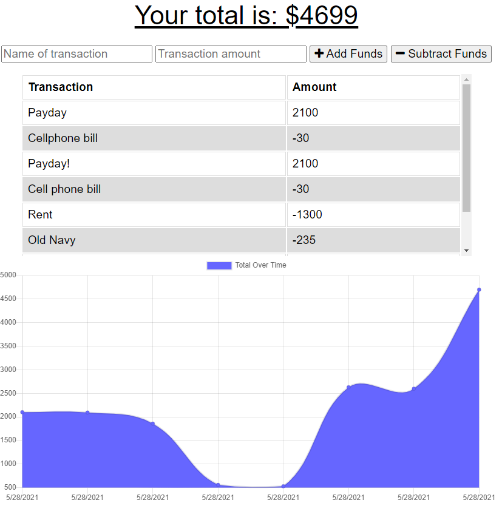

# Budget Tracker (PWA)

## Description
A budget tracker to keep track of deposits and withdrawals. Because this is a PWA, you can download it as an app on your desktop or mobile device and can add transactions regardless of internet connection.

## Table of Contents
  * [Installation](#installation)
  * [Usage](#usage)
  * [License](#license)
  * [Contributing](#contributing)
  * [Tests](#tests)
  * [Screenshots](#screenshots)
  * [Questions](#questions)

  ## Installation
  To use this application, navigate to [https://winn-pwa-budget-tracker.herokuapp.com/](https://winn-pwa-budget-tracker.herokuapp.com/) to use application. To save as a PWA in Chrome on desktop, click the computer/down arrow icon next to the address bar to download as an app. Navigate to chrome://apps to see your budget tracker app.

  ## Usage
  Once the application is open, add the name and value of your transaction and click whether it is a deposit (+Add Funds) or a withdrawal (-Subtract Funds). The transaction history and transaction graph are listed below and update as the buttons are clicked.
  
  ## License
  N/A
  ## Contributing
  N/A

  ## Tests
  N/A

  ## Screenshots
  Application Example
  
  

  ## Questions
  If you have any questions, please contact me at [alyssawinn2@gmail.com](mailto:alyssawinn2@gmail.com) or visit my GitHub page [here](https://github.com/alyssawinn/)

